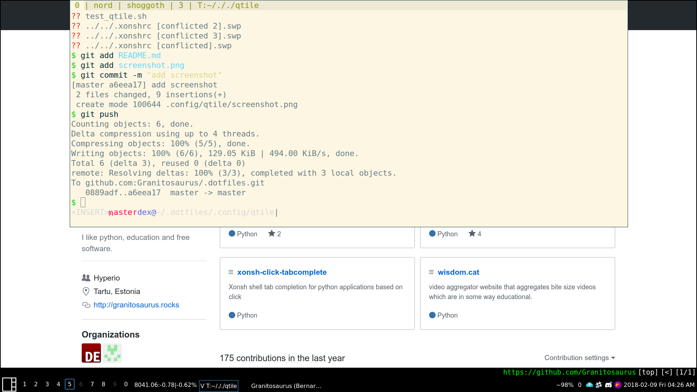

# Full Modern Qtile Config

This config features:

* Clean layout 
* Drop down terminal
* Sane keybinds
* Modular configuration, split across multiple files

This config is split into modules:

* keys - hotkeys and keybindings
* layouts - screen layouts
* solarized - solarized colors
* config - main config file that imports everything and is used by Qtile

Additional module:

* dropdown - dropdown terminal logic (should be available in the newest qtile upstream version)
* widgets - contains custom widgets, in this case crypto currency tracker widget.
* scratchpad - scratchpad logic (unused in this config at the moment)

Additional scripts:

* test_qtile.sh - script for testing qtile configs using [xephyr](https://wiki.archlinux.org/index.php/Xephyr)

## Requirements and Dependancies

This config is based on arch-linux and is using some tools that do not come with qtile or arch linux.

### Rofi launcher

Rofi launcher is used for launching and jumping between applications:

    * meta-d - launch rofi drun menu  
    * meta-e - launch rofi window menu

### Terminal

Urxvt is being used as default terminal:

    * meta-<enter> - launch terminal window
    * F12 - launch dropdown terminal window

See my .Xresources file for urxvt config and plugins.

### Screenshots

For screenshots `Flameshot` is being used:

    * <Print-Screen> - launch flameshot screen capture

### Wallpaper

For wallpaper `feh` is being used. There's a startup hook that sets `~/.wallpaper` as your wallaper using feh.

# Quick intro

_m - meta key (aka windows button on your keyboard)_

There are 10 workspaces numbered 1-10 and accessible with `m-<n>` hotkey (e.g. "windows" button + 1 will give you first workspace)  
To move a windows to different worksppace use `shift-m-<n>`. 

There are 2 layouts enabled: `Max` and `MonadTall` and they can be switched between with `m-tab` hotkey. There's an indicator at bottom left corner for which layout is being used.  
Third layout is floating layout that can be toggled with `m-space`.  
You can also make apps fullscreen with `m-f`.  

To launch application `m-d` is used to start rofi drun menu. To switch between particular windows `m-e` is used to launch rofi window menu. This will switch directly to application window no matter where it is.

For terminal qtiles dropdown `urxvt` terminal is being used. `F12` key will launch and toggle dropdown terminal. 
